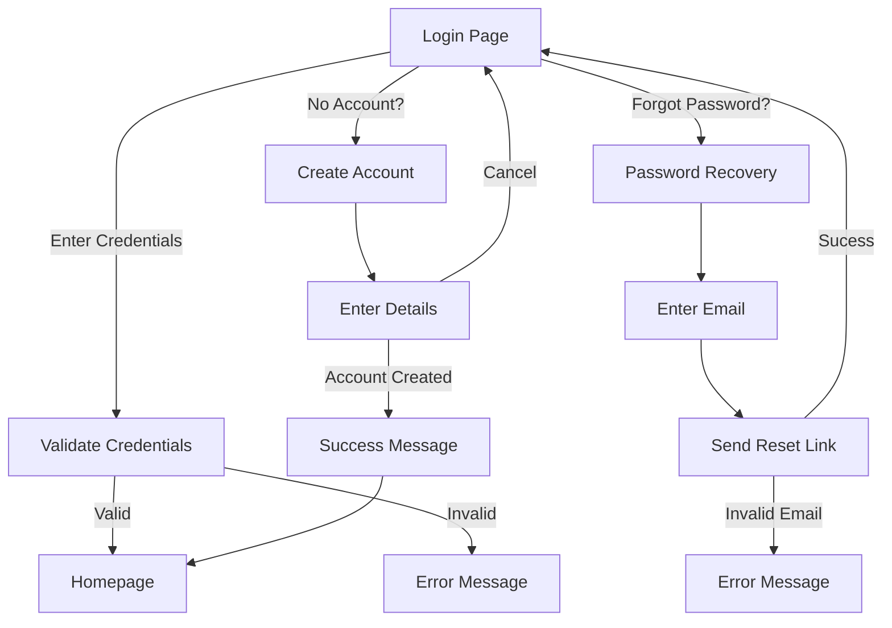
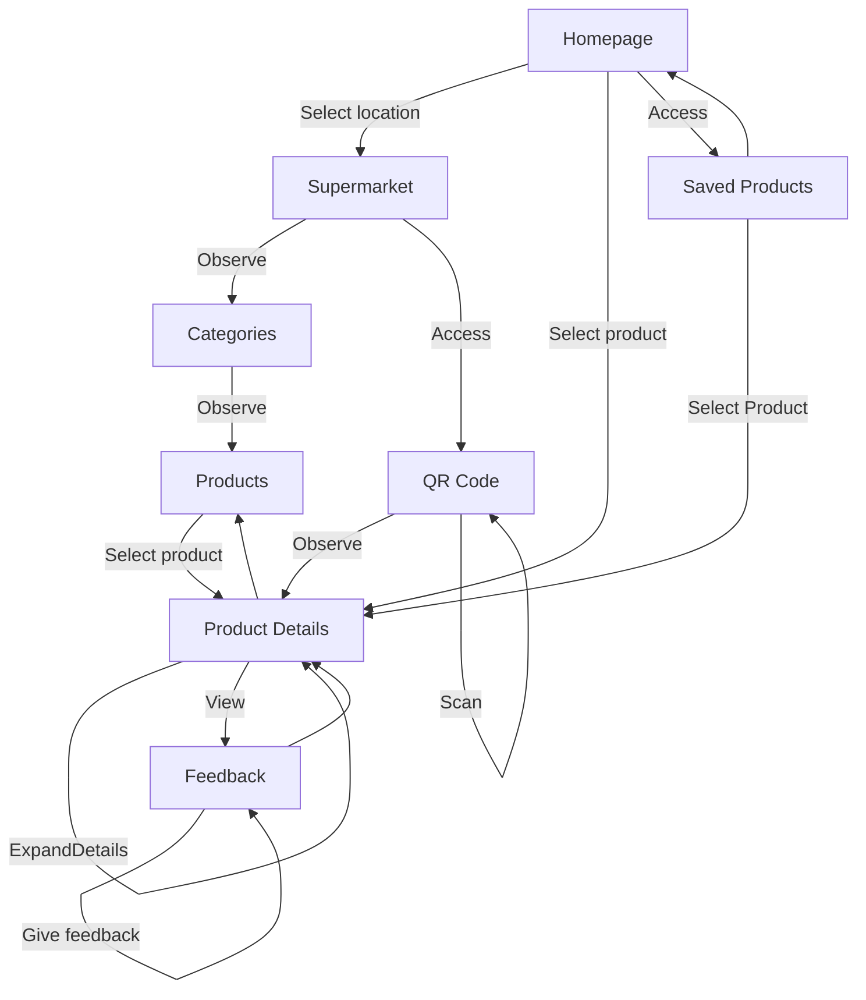
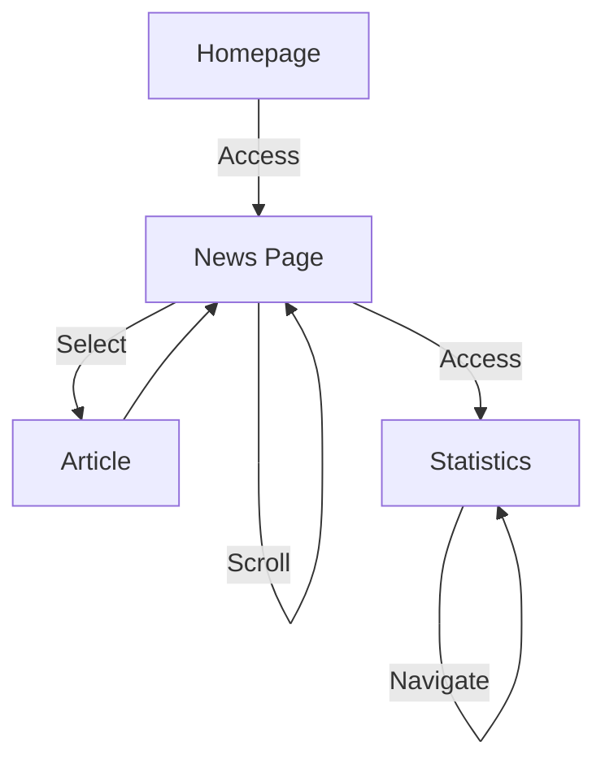

# `Story-Space` and `FE Orchestration` for QRMeat

## Story 1 - Login

### FE Orchestration

| Workflow  | Steps                                                                                 |
|:-----------:|:-------------------------------------------------------------------------------------:|
|     1       | Login Page → Enter Credentials → Validate Credentials → Home Page |
|     2       | Login Page → Enter Credentials → Validate Credentials → Error |
|     3      | Login Page → Password Recovery → Enter Email → Send Reset Link → Login Page |
|     4      | Login Page → Password Recovery → Enter Email → Send Reset Link → Error |
|     5       | Login Page → Create Account → Enter Details → Create Account → Account Created → Success Message → Homepage |

## Story 2 - Accessing Products

### FE Orchestration

| Workflow  | Steps                                                                                 |
|:-----------:|:-------------------------------------------------------------------------------------:|
|     1       | Select location → Observe Categories → Observe Products → Select product → View Product Details  → View Feedback → Save product → Give Feedback      |
|     2       | Select location → Access QR Code → Scan Product → Observe Product Details → View Feedback → Save product → Give Feedback |
|     3       | Select product → View Feedback → Save product → Give Feedback |
|     4       | Access Saved Products → Select product → View Feedback → Save product → Give Feedback |

**Note:** QRMeat is an app with the goal of informing users about the **details of the meat products** they consume, such as their origin and history. Thus, the primary aim of the app is reflected in its functionality, as the majority of interactions guide users towards the `Products Details` page, as seen above.

## Story 3 - Accessing News and Statistics

### FE Orchestration

| Workflow   | Steps                                                                                          |
|:-----------:|:----------------------------------------------------------------------------------------------:|
|     1       | Access News Page → Scroll News → Select Article → Return to News Page → Access Statistics → Navigate Statistics|
|     2       | Access News Page → Access Statistics → Navigate Statistics                        |

