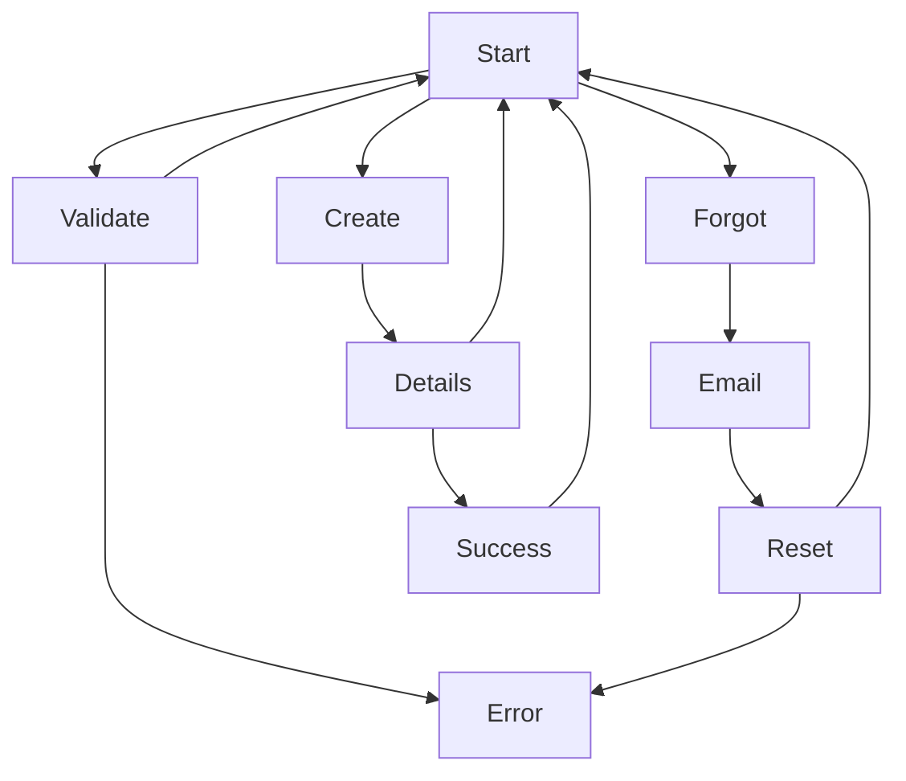

# Stories and FE Orchestration for QRMeat

## Story - Login

### FE Orchestration

| Workflow | Steps |
|:---:|:---|
| 1 | Login Page → Enter Credentials → Validate Credentials → Home Page |
| 2 | Login Page → Enter Credentials → Validate Credentials → Error |
| 3 | Login Page → Password Recovery → Enter Email → Send Reset Link → Login Page |
| 4 | Login Page → Password Recovery → Enter Email → Send Reset Link → Error |
| 5 | Login Page → Create Account → Enter Details → Create Account → Account Created → Success Message → Homepage |

